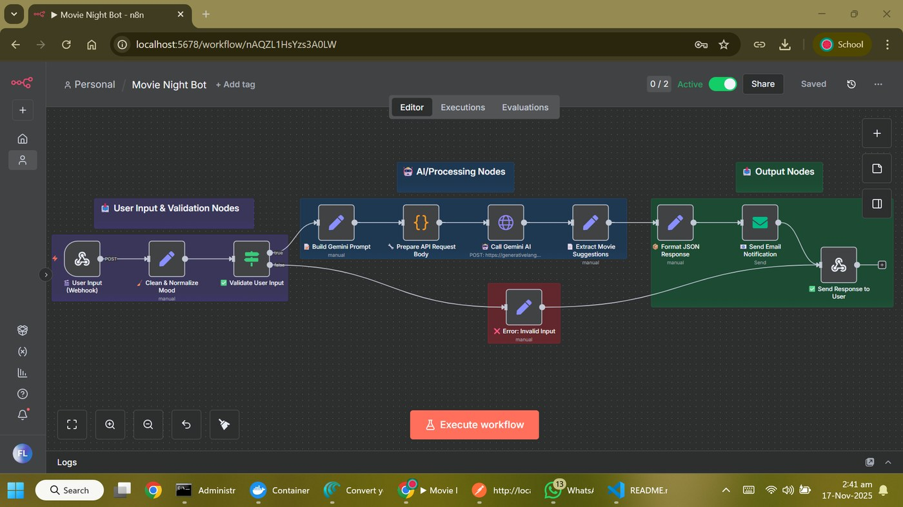

# 🎬 Movie Night Bot - n8n Workflow

Movie Night Bot is an n8n automation workflow that recommends movies based on a user's mood or genre.

The user sends a mood such as `happy`, `sad`, `romantic`, `thriller`, or `scary` to a webhook. The workflow validates the input, builds a prompt, calls Google Gemini AI, extracts 3 movie suggestions, sends an email notification, and returns a clean JSON response.

---

## 📌 Project Overview

Choosing a movie can be weirdly difficult. This workflow solves that small but real problem by acting like a lightweight movie recommendation assistant.

It asks:

```text
What should I watch tonight?
```

Then it recommends 3 movies based on the mood or genre provided by the user.

This project was created as an n8n automation assignment and demonstrates a basic AI-powered recommendation system using a webhook, validation logic, API request handling, and response formatting.

---

## ✨ Features

- Accepts user mood or genre through a webhook.
- Cleans and normalizes user input.
- Validates empty or invalid input.
- Builds a custom Gemini prompt.
- Calls Google Gemini AI using an HTTP Request node.
- Uses environment variable for Gemini API key.
- Returns exactly 3 movie suggestions.
- Explains why each movie fits the user's mood.
- Sends an email notification with the suggestions.
- Returns a JSON response to the user.
- Includes error handling for missing input.

---

## 🧠 AI Concept

This project demonstrates a basic **Recommendation System**.

```text
User Mood / Genre → Prompt Engineering → Gemini AI → 3 Movie Recommendations
```

---

## 🛠️ Tech Stack

| Category | Technology |
|---|---|
| Automation Platform | n8n |
| AI Model | Google Gemini 2.0 Flash |
| API Method | HTTP Request |
| Input | Webhook |
| Output | JSON Response + Email |
| Testing Tool | Postman / cURL |
| Format | n8n Workflow JSON |

---

## 📁 Repository Structure

```text
Movie-Night-Bot-n8n/
│
├── workflow/
│   └── movie_night_bot_env_ready.n8n.json
│
├── screenshots/
│   └── workflow-overview.jpg
│
├── sample_data/
│   ├── sample_request.json
│   └── sample_response.json
│
├── .env.example
├── .gitignore
└── README.md
```

---

## 🖼️ Workflow Preview



---

## 🏗️ Workflow Architecture

```text
User Input Webhook
      ↓
Clean & Normalize Mood
      ↓
Validate User Input
      ↓
Build Gemini Prompt
      ↓
Prepare API Request Body
      ↓
Call Gemini AI
      ↓
Extract Movie Suggestions
      ↓
Format JSON Response
      ↓
Send Email Notification
      ↓
Send Response to User
```

Invalid input goes to an error response path.

---

## 🔐 Environment Variables

Create a local `.env` file using `.env.example`:

```env
GEMINI_API_KEY=your_gemini_api_key_here
SMTP_USER=your_email@example.com
SMTP_APP_PASSWORD=your_gmail_app_password_here
```

The workflow uses this expression inside the Gemini HTTP Request node:

```text
={{ $env.GEMINI_API_KEY }}
```

Do not commit `.env` to GitHub.

---

## 🔌 API Usage

### Local Test Endpoint

```text
POST http://localhost:5678/webhook-test/movie-night
```

### Active Workflow Endpoint

```text
POST http://localhost:5678/webhook/movie-night
```

---

## 📤 Request Body

```json
{
  "mood": "happy"
}
```

Example moods:

```text
happy, sad, romantic, thriller, scary, action, comedy, adventure, depressed
```

---

## 📥 Example Success Response

```json
{
  "status": "success",
  "mood": "happy",
  "suggestions": "Movie 1:\nTitle: The Grand Budapest Hotel (2014)\nWhy watch: ...",
  "emailSent": true
}
```

---

## 🚀 How to Run Locally

### 1. Start n8n

Make sure your environment variables are available before starting n8n.

Windows PowerShell example:

```powershell
$env:GEMINI_API_KEY="your_key_here"
$env:SMTP_USER="your_email@example.com"
npx n8n
```

macOS/Linux example:

```bash
export GEMINI_API_KEY="your_key_here"
export SMTP_USER="your_email@example.com"
npx n8n
```

Open:

```text
http://localhost:5678
```

### 2. Import the Workflow

Import:

```text
workflow/movie_night_bot_env_ready.n8n.json
```

### 3. Configure Email Node

Open the email node and add your SMTP/Gmail credentials in n8n.

### 4. Test with cURL

Windows:

```bash
curl -X POST http://localhost:5678/webhook-test/movie-night ^
  -H "Content-Type: application/json" ^
  -d "{\"mood\":\"happy\"}"
```

macOS/Linux:

```bash
curl -X POST http://localhost:5678/webhook-test/movie-night \
  -H "Content-Type: application/json" \
  -d '{"mood":"happy"}'
```

---

## ✅ Current Status

The workflow is complete as an academic n8n automation project. It satisfies the core requirements:

- Webhook input
- Mood/genre-based recommendation
- AI/API processing
- 3 movie suggestions
- JSON response
- Email notification

---

## ⚠️ Limitations

- Recommendations depend on Gemini output.
- No movie posters, ratings, or trailer links yet.
- Does not use IMDb/TMDB database yet.
- No user history or personalization storage.
- Email credentials must be configured manually.
- Current version is designed for local n8n testing.

---

## 🔮 Future Improvements

- Add TMDB API for posters, ratings, and release years.
- Add genre filtering with stricter rules.
- Store user requests in Google Sheets or Airtable.
- Add Telegram/WhatsApp/Discord output.
- Add a simple frontend form.
- Add multilingual recommendations.
- Add movie trailer links.
- Add fallback rule-based recommendations if Gemini API fails.

---

## 🏷️ Suggested GitHub Topics

```text
n8n, automation, workflow-automation, movie-recommendation, recommendation-system, gemini-ai, google-gemini, webhook, ai-project, no-code
```

---

## 👨‍💻 Author

**Fayz Liaqat**  
Artificial Intelligence Student
